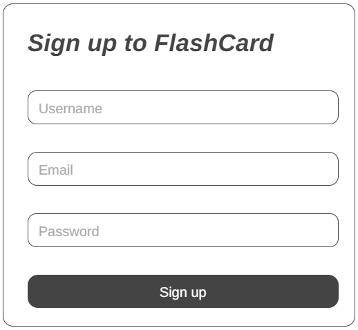

# Flashcard-Web-App

## Overview
A flashcard application designed to help users learn and memorize information effectively through customizable flashcards. It supports user authentication, flashcard creation to enhance learning.

## Project Objective
- To develop a secure flashcard application.
- To provide an interactive way for users to learn through flashcards.
- To allow users to organize flashcards into different categories and decks.

## Tech Stack
- **Frontend**: React.js
- **Backend**: Node.js with Express
- **Database**: MongoDB or PostgreSQL
- **Authentication**: JWT (JSON Web Token)
- **Styling**: TailwindCSS or Styled Components
- **Real-time**: Optional – For future improvements like collaborative study sessions or real-time flashcard updates.

## Project Workflow

- **User Signup/Login**: Users register with their name, email, and password, and log in using their credentials.
  
- **Authentication Validation**: User credentials are verified via JWT authentication to grant access to the app.
  
- **Flashcard Management**: Users can create, update, and delete flashcards. They can organize flashcards into different decks (e.g., Math, History, etc.).

- **Flashcard Search**: Allows users to search for specific flashcards by keywords, questions, or answers.

- **Profile Management**: Users can view and update their profile details.

## Features

- **User Authentication**: Secure login and registration with JWT-based authentication.
- **Flashcard Creation**: Users can create flashcards with questions, answers, and optional hints.
- **Deck Management**: Users can organize flashcards into multiple decks (e.g., by subject or category).
- **Search Functionality**: Quickly search for flashcards based on content.

## Layout Images

 
